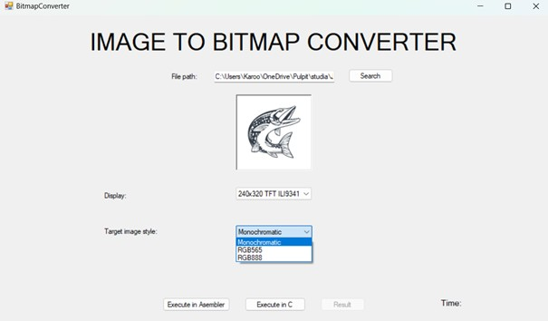

# Bitmap_converter for OLED/TFT displays on microcontrollers

This application converts JPG images into a format ready for implementation in code supporting OLED/TFT displays on microcontrollers. 
It allows image scaling and format selection, including monochrome and RGB modes, depending on the display type.
This program exports DLLs with the same implementation written in Assembly and C++.

1. Features 
- Convert JPG images to formats compatible with OLED and TFT displays.
- Scale images to fit different screen resolutions.
- Support for monochrome, RGB565 and RGB888 formats.
- Output images in ready-to-use format for microcontroller-based projects.

2. Available displays
- 128x64 OLED SSD1306
- 128x160 TFT ST7735
- 240x320 TFT ILI9341

4. Example

After loading image, choose your display and format

Then press execute to run convertion

Result on the display

